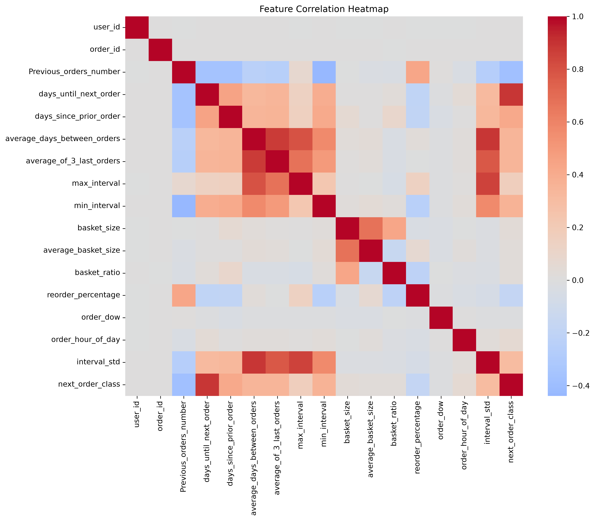

# Predicting when a user is most likely to purchase again using machine learning

## Overview

The purpose of this project was to predcit when a user is most likely to purchase from a store again. This project is of business importance as it enables business to estimate when customers are likely to mke their next order, supporting targetted marketing campaigns and inventory planning. The final output of the project is a web app that can make a prediction on when a user is most likely to return when given some information. 

I first used SQL to do some exploratory data analysis, and decided on the primary question. I then exported the data to python to train an XGBoost model. I jumped between SQL and python frequently, using SQL to change my features for the model, and python to train the model. 

## Dataset

The dataset is the Instacart Market Basket Analysis dataset which can be found on kaggle [here](https://www.kaggle.com/datasets/psparks/instacart-market-basket-analysis). I combined the included tables with additional tables I generated in python during exploratory analysis. The dataset has ~200000 users and 3 million orders, and contains information on what each order was, what products were bought, what aisle and department the products were from, what user did that order and how long it had been since that user last made an order.

## Tools used

Python:
- Pandas
- XGBoost

SQL:
- Window functions
- Common table expressions (CTEs)

Machine Learning:
- XGBoost
- Scikit-learn

Visualisation:
- Matplotlib
- Seaborn

## Developing the model

#### Train/Test methodology

The dataset contains a chronological sequence of orders for each user, with the number of days until the following order used as the prediction target. The final order for each user was removed from the dataset because the future reorder interval is unknown (they haven't returned yet), and therefore the target value cannot be calculated. The penultimate order for each user was reserved as the test example and all earlier orders were used for training. This mirrors how the model would be used - being trained on the previous data of users in order to make estimates for their next actions.

#### Model shape

The model was initially an XGBRegressor, predicting the number of days until a user returns. This model had major issues - It had an r^2^ of 0.195 and a MAE of 7.88 days. This is an issue as a prediction error of approximately one week made the model less useful for making actionable predictions. As such I decided to change the model to a XGBClassifier, classifying each order into:
- likely to return in 0-4 days
- likely to return in 5-7 days
- likely to return in 8-14 days
- likely to return in 14+ days

Despite being more general, this model achieved significantly better predicitive performance, showing that it did a better job of predicting when a user is likely to return.

#### Feature Engineering

Most of the features were engineering in SQL using window functions and common table expressions. This includes behavioural features such as:
- basket statistics 
- minimum and maximum reorder interval size (the largest amount of days and the least amount of days between consequentive orders over a given timeframe)
- reorder percentage (how many of the items in the baskets had been ordered by this user before)
- standard deviation (which does not exist as an aggregate function in SQLite, and thus had to be manually made)

Some features were made in python - namely ordering_speed_change, is_weekend and basket_change. This was because I found them easier to make in python. Ultimatelky though, their collective importance was ~3.2%, so I choice not to use these to reduce unnecessary complexity (the more_data() function remains unused in the python file).

Many features were tried during the project. Intially, the number of products from each aisle and later each department were included as features, however they amounted to a total of ~6% of the importance. Due to this relative unimportance, I made the choice to drop them as they massively increased the processing time for the model.

#### Data Leakage

During the project, There was an issue from data leakage. These took the form of averages which were aggregated over every order of the user. This allowed the XGBoost Classifier to indirectly access information from the test example, as the average included the the number days for the penultimate data row - the row reserved for testing. This could be seen by the model asigning almost all feature importance to this value. I chose to make all averages moving averages for this reason, ensuring that data leakage no longer happened.

#### Hyperparameter Optimisation

I used RandomizedSearchCV to tune the hyperparameters to maximise macro F1. I tuned on a large number of variables, and as the model took a long time to train I chose to use RandomizedSearchCV. This was because it helped to ensure that the best hyperparameters could be picked without having to spend too long testing. I manually refined a few variables afterwards - namely learning rate and n_estimators - as i felt these were slightly wrong. RandomizedSearchCV increased the accuracy by approximately 1%, and manual tuning by 0.5%.

## Results

The final XGBoost classification model achieved an accuracy of **55.75%** and a macro F1-score of **0.44** on the held-out test set. This represents a significant improvement over random guessing. The model performed best when predicting longer reorder intervals, while most errors occurred between adjacent time windows, particularly between the 8–14 day and 15+ day classes. This suggests that the model successfully captured general customer purchasing patterns.

Feature importance analysis showed that historical ordering behaviour was the strongest predictor of future return time. The most influential features included the number of days since the previous order, minimum historical interval, average ordering interval, and recent ordering behaviour. This highlights that customer purchase frequency and consistency were more predictive than product category information, which contributed relatively little to model performance.

## Limitations

One limitation of this project is that despite this model ultimately being better than the Regressor model, this model still predicts time windows rather than an exact amount of days. Future work could revisit a regression approach using additional behavioural features and alternative models.

This model also relise on sufficient historical data as it does not rely at all on what the user bought, instead relying primarily on said historical data. This makes the model ineffectove for making predictions about new customers.

The model struggles to distinguish between neighbouring reorder windows, as customer behaviour can vary significantly even for users with similar histories. This can be seen in the confusion matrix, and is most of note for over-predicting users in the 7-14 range into the 14+ range.

## Conclusions

Ultimately, this project displayed my ability to build an end-to-end machine learning pipeline from raw data, carefully engineering features using SQL queries and python and preventing data leakage to predict a genuine business question. The project demonstrates practical experience in SQL feature engineering, machine learning, model evaluation, and deploying a predictive model through a simple web application. It shows iterative experimentation that results in a 55.75% accuracy - substantially better than the 25% baseline expected from random classification.

